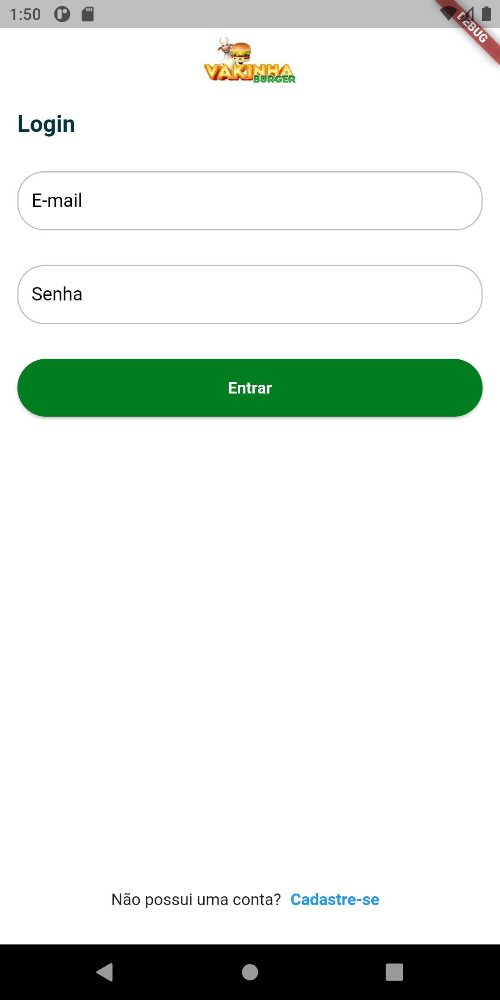
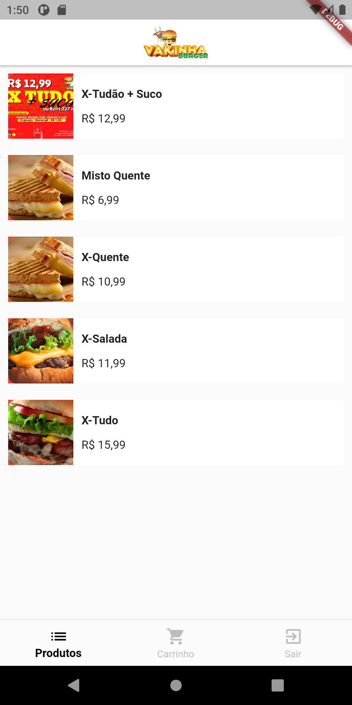
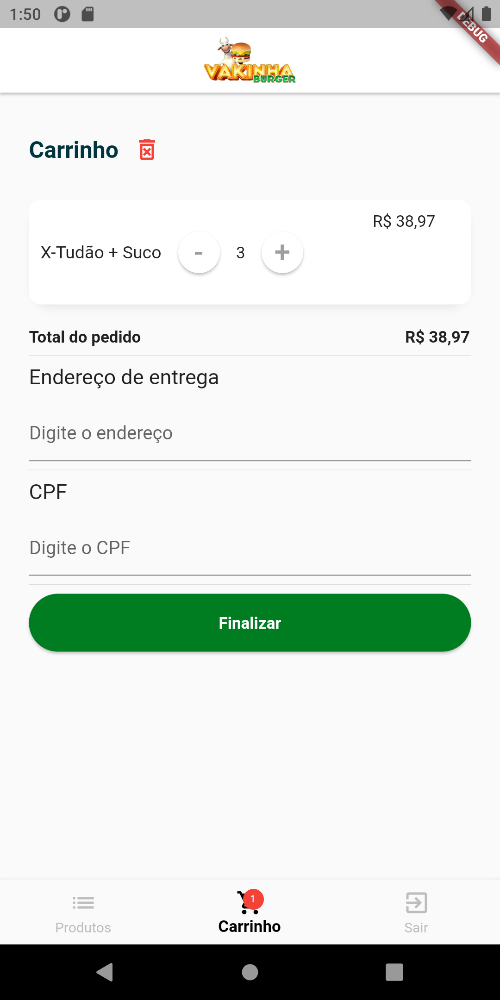

# dart_week

# Resumo e descrição do projeto do
Projeto desenvolvido pela Academia do Flutter 
Onde foi desenvolvido um aplicativo, estilo o ifood onde adicionamos produtos ao carrinho e finalizamos o  produto com a compra dele.
# Assets
| 
| :---: | :---: |
| 
| :---: | :---: |

# Tecnologia usada
Versão do Flutter utilizada
-  sdk: ">=2.15.1 <3.0.0"  
Dependencias do Get para requisições
-  get: ^4.6.1
-  get_storage: ^2.0.3  
Validador de campos do input
-  validatorless: ^1.2.1  
Formatador de campo
-  intl: ^0.17.0
